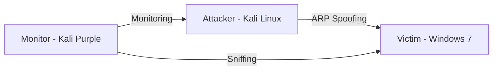

````markdown
 🧪 Cybersecurity Homelab by Mohamed Oughzaif

This is my personal homelab environment for learning and practicing ethical hacking, penetration testing, and network monitoring using virtual machines.

---

 🖥️ Virtual Machines Used

| Operating System     | Role                  | Tools Installed                                        |
|----------------------|-----------------------|--------------------------------------------------------|
| **Kali Linux**       | Attacker              | Bettercap, Nmap, Wireshark, (planned: Metasploit)     |
| **Kali Purple**      | Defensive / Monitoring| Suricata, Zeek, Wazuh, CyberChef                       |
| **Windows 7 Ultimate** | Victim / Target     | Testing payloads, sniffing, spoofing, network analysis |

---

 🧰 Tools & Techniques Practiced

- ✅ ARP spoofing with **Bettercap**
- ✅ MAC flooding using `macof`
- ✅ Real-time packet sniffing with `net.sniff`
- ✅ Network visibility mapping using `net.show`
- ✅ Network obfuscation with flooding to hide attacks
- 🔜 Coming soon: `msfvenom` payload creation and reverse shell exploitation

---

 🗂️ Project Structure

```bash
📁 Kali/
│   └── tools_used.md
│   └── screenshots/
📁 KaliPurple/
│   └── monitoring_setup.md
📁 Windows7/
│   └── setup_notes.md
📄 README.md
````

---

 📸 Screenshots (To be uploaded)

Add your screenshots in the `screenshots/` folder:

* Bettercap in action
* Terminal showing `macof`
* VirtualBox network settings
* Windows 7 network activity

---

 🌐 Network Diagram



---

 🎯 Purpose of This Lab

This lab allows me to:

* Practice real-world offensive techniques in a safe and isolated setup
* Learn defensive monitoring and detection tools
* Understand how attackers think and how defenders respond
* Prepare for certifications such as:

  * 🛡️ **eJPT** – Junior Penetration Tester
  * 🛡️ **OSCP** – Offensive Security Certified Professional
  * 🛡️ **CEH** – Certified Ethical Hacker

---

 📫 About Me

I'm Mohamed Oughzaif, a self-taught cybersecurity enthusiast building a strong foundation in both offensive and defensive security.

* 💼 [LinkedIn](https://www.linkedin.com/in/mohamad-oughzaif-a6406a246/)
* 💻 [GitHub](https://github.com/SecretsDev)
* 🌐 Portfolio: Coming Soon!

---

> 🧠 *This homelab is for educational purposes only. All tests are performed in isolated virtual machines I fully control.*

```
